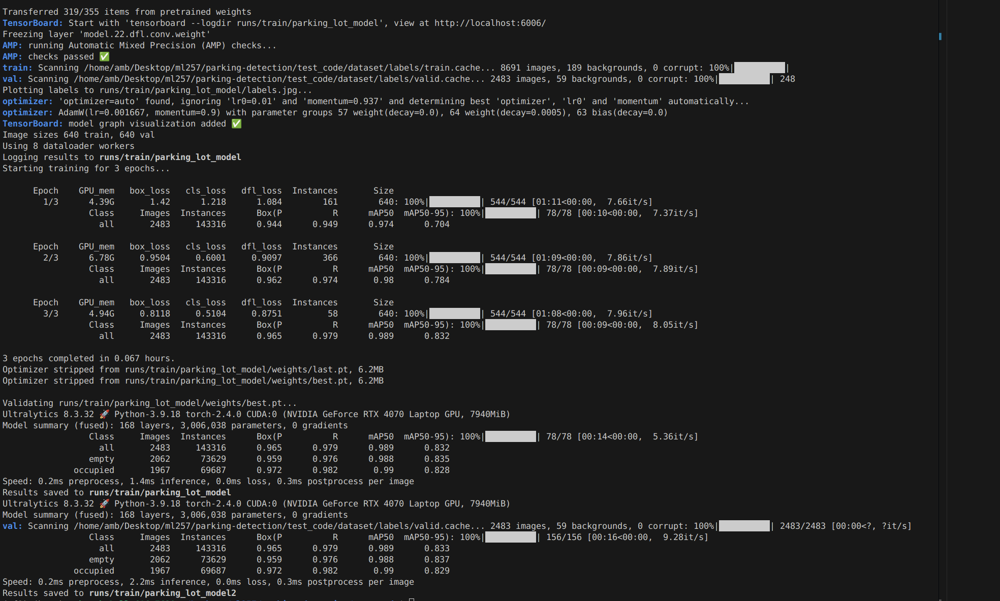
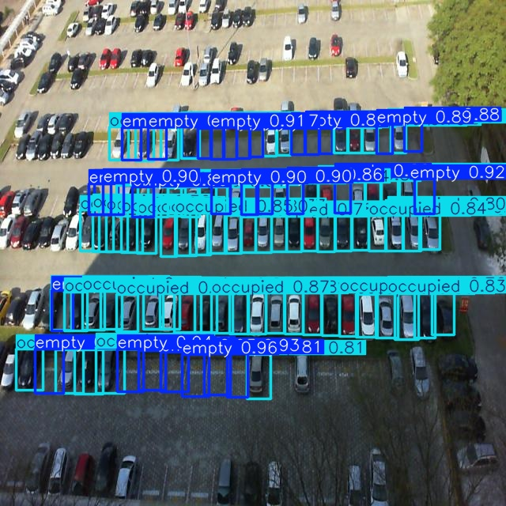

### Install
1. Yolo installation from ultralytics
2. other cuda/torch/opencv installations.

https://docs.ultralytics.com/guides/conda-quickstart/#installing-ultralytics

https://blog.roboflow.com/how-to-train-yolov8-on-a-custom-dataset/

now need yolov8 dataset from roboflow where annotations in text format. Need direct structure like the below
```
└── PKLotYolov8
    ├── test
    │   ├── images
    │   └── labels
    ├── train
    │   ├── images
    │   └── labels
    ├── valid
    │   ├── images
    │   └── labels
    └── yolo_preprocessed
        ├── empty
        └── non-empty
```

### How to run
1. python3 `yolopreprocessing.py`
it will create a directory as dataset with relevant train and valid with yml file for training. they are not cropped but just for structure
2. python3 `yolomodeling.py`
This one is for modeling and getting th yolovn8.pt model to be trained with the custom images. They use the previous preprocessed data for modeling

3. python3 `yolovalidation.py` this one is to validate the validation set and give a score.

4. python3 `yolotesting.py` this one is to test and visualize and create bounding boxes. you ll have to set path of test imahe and folder

```
run
├── detect
│   ├── predict
│   │   └── labels
│   ├── predict2
│   │   └── labels
│   ├── predict3
│   │   └── labels
│   ├── predict4
│   │   └── labels
│   └── val
└── train
    ├── parking_lot_model
    │   └── weights
    ├── parking_lot_model2
    │   └── weights
    └── parking_lot_model22
```

detect willhave the images with labels and score. 

Result in `./runs/detect/predict/`
